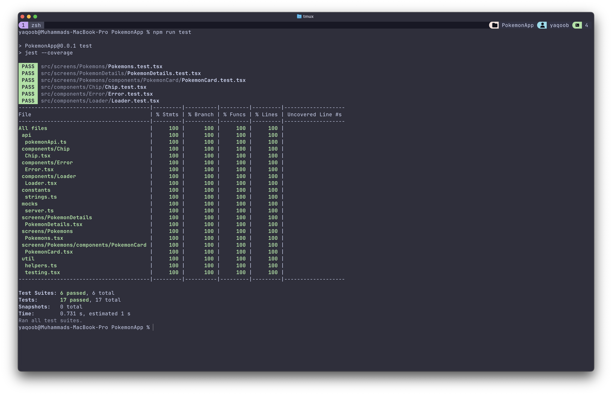

This is a new [**React Native**](https://reactnative.dev) project, bootstrapped using [`@react-native-community/cli`](https://github.com/react-native-community/cli).

# Getting Started

> **Note**: Make sure you have completed the [Set Up Your Environment](https://reactnative.dev/docs/set-up-your-environment) guide before proceeding.

## Step 1: Cloning the repository

Run the following commmand to clone this project

```sh
git clone https://github.com/yaqoobhisbani/PokemonApp.git
```

## Step 2: Installing Dependencies

Once you have cloned this project, navigate to this project in your terminal using cd command. For example `cd PokemonApp`.

Then run the following command for installing dependencies

```sh
# Using npm
npm install

# OR using Yarn
yarn
```

### iOS

For iOS, you need to install CocoaPods dependencies also, which can be done using following commmand.

```sh
# Using NPX from root directly
npx pod-install ios

# OR
cd ios
pod install
```

You should have your dependencies install now.

## Step 3: Running the app

After installing dependencies, we can run the app using folllowing steps.

First we need to start Metro, the JavaScript build tool for React Native.

### 3.1: Start Metro server

To start the Metro dev server, run the following command from the root of your React Native project:

```sh
# Using npm
npm start

# OR using yarn
yarn start
```

> **Note**: The start script is configured to use the `BASE_URL` environment variable. If you need to change it, please have a look at `start` script in `package.json` file.

### 3.2: Build and run the app

With Metro running, open a new terminal window/pane from the root of your React Native project, and use one of the following commands to build and run your Android or iOS app:

### Android

```sh
# Using npm
npm run android

# OR using yarn
yarn android
```

### iOS

```sh
# Using npm
npm run ios

# OR using yarn
yarn ios
```

If everything is set up correctly, you should see your new app running in the Android Emulator, iOS Simulator, or your connected device.

## Congratulations! 🎉

You've successfully run this project. 🥳

# Running Test Cases

This project is configured to use jest for test runner. Simply run the following command to run the test cases.

```sh
# Using npm
npm test

# OR using yarn
yarn test
```

You should see the results like the screenshot below


# Project Structure

The project structure looks like below.

```
├── android
├── ios
├── src
│   ├── App.tsx
│   ├── api
│   │   └── pokemonApi.ts
│   ├── components
│   │   ├── Chip
│   │   │   ├── Chip.test.tsx
│   │   │   └── Chip.tsx
│   │   ├── Error
│   │   │   ├── Error.test.tsx
│   │   │   └── Error.tsx
│   │   └── Loader
│   │       ├── Loader.test.tsx
│   │       └── Loader.tsx
│   ├── constants
│   │   └── strings.ts
│   ├── mocks
│   │   └── server.ts
│   ├── navigation
│   │   └── RootNavigator.tsx
│   ├── redux
│   │   └── store.ts
│   ├── screens
│   │   ├── PokemonDetails
│   │   │   ├── PokemonDetails.test.tsx
│   │   │   └── PokemonDetails.tsx
│   │   └── Pokemons
│   │       ├── Pokemons.test.tsx
│   │       ├── Pokemons.tsx
│   │       └── components
│   │           └── PokemonCard
│   │               ├── PokemonCard.test.tsx
│   │               └── PokemonCard.tsx
│   ├── types
│   │   ├── declarations.d.ts
│   │   ├── navigation.d.ts
│   │   └── pokemonApi.d.ts
│   └── util
│       ├── helpers.ts
│       └── testing.tsx
├── Gemfile
├── ReactotronConfig.ts
├── app.json
├── babel.config.js
├── index.js
├── jest.config.js
├── metro.config.js
├── msw.polyfills.js
├── package-lock.json
├── package.json
└── tsconfig.json
```
